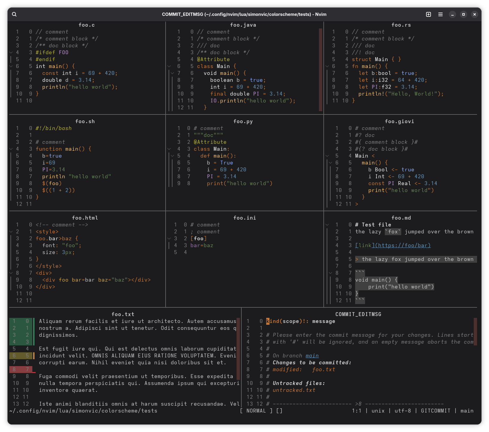
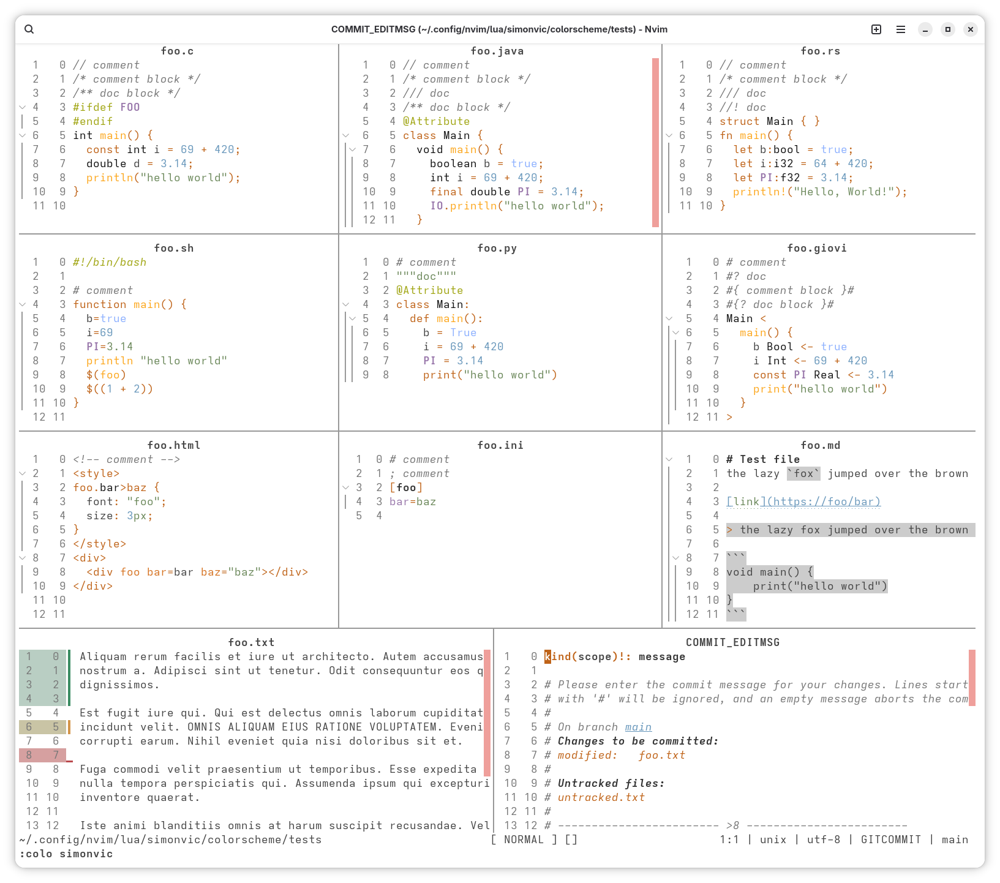

My personal collection of neovim colorschemes with treesitter and semantic
highlights support.

All colorschemes have a dark and light variant; the appropriate one will be
used when you `set background=dark` or `set background=light` 

# Screenshots

Default dark

Ruby dark

Silver monochrome light

## All variants

<table>
    <thead>
        <tr>
            <th>Light</th>
            <th>Dark</th>
        </tr></thead>
    <tbody>
        <tr>
            <td colspan="2" align="center">simonvic</td>
        </tr>
        <tr>
            <td></td>
            <td></td>
        </tr>
        <tr>
            <td colspan="2" align="center">simonvic_ruby</td>
        </tr>
        <tr>
            <td></td>
            <td></td>
        </tr>
        <tr>
            <td colspan="2" align="center">simonvic_ruby_monochrome</td>
        </tr>
        <tr>
            <td></td>
            <td></td>
        </tr>
        <tr>
            <td colspan="2" align="center">simonvic_silver_monochrome</td>
        </tr>
        <tr>
            <td></td>
            <td></td>
        </tr>
    </tbody>
</table>
