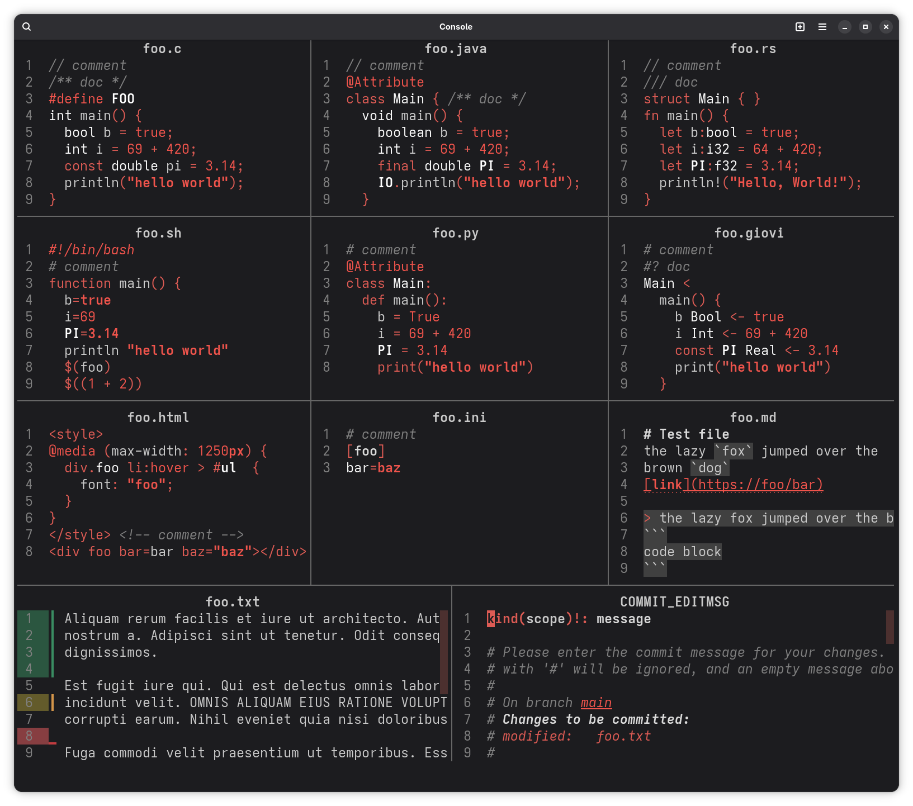

My personal collection of neovim colorschemes with treesitter and semantic
highlights support.

All colorschemes have a dark and light variant; the appropriate one will be
used when you `set background=dark` or `set background=light` 

# Overview

Ruby dark


Opal dark


Silver monochrome light


## All variants

<table>
	<thead>
		<tr>
			<th>Light</th>
			<th>Dark</th>
		</tr></thead>
	<tbody>
		<tr>
			<td colspan="2" align="center">simonvic_opal</td>
		</tr>
		<tr>
			<td></td>
			<td></td>
		</tr>
		<tr>
			<td colspan="2" align="center">simonvic_ruby</td>
		</tr>
		<tr>
			<td></td>
			<td></td>
		</tr>
		<tr>
			<td colspan="2" align="center">simonvic_ruby_monochrome</td>
		</tr>
		<tr>
			<td></td>
			<td></td>
		</tr>
		<tr>
			<td colspan="2" align="center">simonvic_silver_monochrome</td>
		</tr>
		<tr>
			<td></td>
			<td></td>
		</tr>
	</tbody>
</table>

# Customization

Each colorscheme is a lua module that returns a `Colorscheme` with which you
can `:build()` a new one using it as a base, and then `:apply()`

For example, creating a new `emerald` theme based on `ruby` is as simple as

```lua
require("simonvic.colorscheme.ruby")
	:build({
		name = "emerald",
		palette = {
			accent = "#00ff00"
		}
	})
	:apply()
```

You can also override the `groups`

```lua
require("simonvic.colorscheme.ruby")
	:build({
		name = "emerald",
		groups = {
			Keyword = { fg = "#00ff00", bold = true }
		}
	})
	:apply()
```

> [!TIP]
> To "delete" a field from a group, you can use an empty string
> ```lua
> DiffAdd = { bg = "" }
> ```

If you need to override the `palette` and use the resulting merged palette in
the `groups`, you can use a function that takes a palette and returns the
groups

```lua
require("simonvic.colorscheme.ruby")
	:build({
		name = "emerald",
		palette = {
			accent = "#00ff00"
		}
		groups = function(palette)
			return {
				Keyword = { fg = palette.accent, bold = true }
			}
		end
	})
	:apply()
```

# Rationale

A `Colorscheme` is made of three things:

- name
- palette: abstract collection of colors
- groups: actual highlight groups definitions

## Palette

A palette mainly consists in accent colors, UI component colors, text colors,
main syntax colors and some more

- Accent colors represents your main favorite color shades.

- UI components are treated as if they were "overlaying layers"; each layer has
a respective `zdepth_n` color

- Most colors in a palette have some `+n` and `-n` shade variants (e.g.
`accent_4` (+4), `accent__4` (-4)), where the `n` represents how much that
shade of color blends with or stands out from the background.

  For example, with a dark background, `accent__4` would be a very dark shade
of `accent`, while `accent_2` a slightly bright shade of `accent`

## Groups

Syntax highlight groups follow some rules:

- **keywords** are what stand out more from the background: they are the main
elements that describe how your code is structured; if you were to squint your
eyes and look at a code snippet from far away, you should still be able to
distinguish a `for` loop statement from a `class` or `function` declaration

- similar rationale for **punctuation**: for example, in an array or function
arguments list, you should easily recognize where each entry begins and ends.

  *insert r/programmerhumor missing semicolon joke here*

- keywords and punctuation, and therefore the structure of your code, should
have the same or similar color

- **metakeywords**, such as preprocessor directives in C or annotations in
Java, should have a very distinctive color from the rest of the code, as they
should feel extraneous to it.

- **literals** (e.g. strings, numbers, booleans) should all have the same or a
similar spectrum of color, that somewhat stands out from the rest of the code

- **comments**: a possibly controversial take, but comments should blend more
rather than standing out; 90% of the time you read code, and comments should
not hinder you when coding. Reading comments should be the exception.

- same applies to **documentation** comments, albeit with a different shade of
the same color.

  You probably read docs more than comments, but you usually do it in your
  editor UI, which supposedly gives you a better experience by rendering
  whatever markup language is used. Reading "raw" docs should be the exception.
